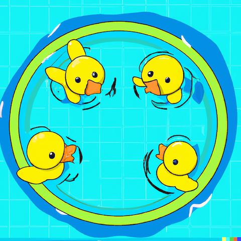

# Casino - WizardingPay

## Stake Ducks

How many of N ducks will swim to the same half of the pool?

> For the convenience of describing the relationship, the table ignores the following denominator, **/ 2^(n-1)**

|     | 1        | 2        | 3        | 4        | 5         | 6         | n-6        | n-5           | n-4           | n-3           | n-2          | n-1              | n        |
|-----|----------|----------|----------|----------|-----------|-----------|------------|---------------|---------------|---------------|--------------|------------------|----------|
| 0   | P(0,0)=0 |          |          |          |           |           |            |               |               |               |              |                  |          |
| 1   |          | P(1,1)=1 |          |          |           |           |            |               |               |               |              |                  |          |
| 2   |          |          | P(2,2)=2 |          |           |           |            |               |               |               |              |                  |          |
| 3   |          |          | P(3,2)=1 | P(3,3)=3 |           |           |            |               |               |               |              |                  |          |
| 4   |          |          |          | P(4,3)=4 | P(4,4)=4  |           |            |               |               |               |              |                  |          |
| 5   |          |          |          | P(5,3)=1 | P(5,4)=10 | P(5,5)=5  |            |               |               |               |              |                  |          |
| 6   |          |          |          |          | P(6,4)=8  | P(6,5)=18 | P(6,6)=6   |               |               |               |              |                  |          |
| 7   |          |          |          |          | P(7,4)=1  | P(7,5)=28 | P(7,6)=28  | P(7,n-5)=7    |               |               |              |                  |          |
| 8   |          |          |          |          |           | P(8,5)=16 | P(8,6)=64  | P(8,n-5)=40   | P(8,n-4)=8    |               |              |                  |          |
| 9   |          |          |          |          |           | P(9,5)=1  | P(9,6)=75  | P(9,n-5)=117  | P(9,n-4)=54   | P(9,n-3)=9    |              |                  |          |
| 10  |          |          |          |          |           |           | P(10,6)=32 | P(10,n-5)=210 | P(10,n-4)=190 | P(10,n-3)=70  | P(10,n-2)=10 |                  |          |
| 11  |          |          |          |          |           |           | P(11,6)=1  | P(11,n-5)=198 | P(11,n-4)=440 | P(11,n-3)=286 | P(11,n-2)=88 | P(11,n-1)=11     |          |
| n   |          |          |          |          |           |           |            | P(n,n-5)=     | P(n,n-4)=     | P(n,n-3)=     | P(n,n-2)=    | P(n,n-1)=(n-3)*n | P(n,n)=n |

P(n, n - 0) = n / 2^(n-1)

P(n, n - 1) = (n - 3) * n / 2^(n-1)

P(n, n - 2) = ...

...

**P(n, n - k) = ...**

> You can see that the probability use this script, [stakeDucks.js](./test/stakeDucks.js)
